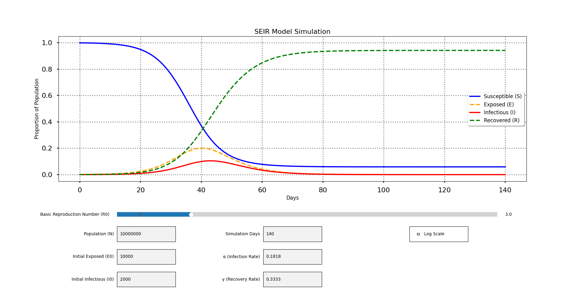

# 🦠 SEIR Model Visualization Tool



## What is the SEIR Model?

The **SEIR model** is a compartmental model used in epidemiology to simulate the spread of infectious diseases. It divides the population into four compartments:

- **S**: Susceptible – individuals who can contract the disease  
- **E**: Exposed – individuals who have been infected but are not yet infectious  
- **I**: Infectious – individuals capable of spreading the disease  
- **R**: Recovered – individuals who have recovered and are immune

The dynamics of the model are governed by the following system of differential equations:

```math
\begin{aligned}
\frac{dS}{dt} &= -\beta S I \\
\frac{dE}{dt} &= \beta S I - \alpha E \\
\frac{dI}{dt} &= \alpha E - \gamma I \\
\frac{dR}{dt} &= \gamma I
\end{aligned}
```

Where:  
- $$\beta$$ is the transmission rate  
- $$\alpha$$ is the rate at which exposed individuals become infectious  
- $$\gamma$$ is the recovery rate

## Repository Structure

This repository contains a lightweight and interactive Python-based tool to explore SEIR model dynamics:

```
📁 SEIR-Interactive/
├── 📁 examples/
│   ├── seir_simulation_default.png    # A sample image showing the default SEIR simulation output
│   └── seir_logscale_enabled.png      # The same simulation with logarithmic scale enabled
│
├── 📁 src/
│   ├── SEIR.py                        # Interactive SEIR visualization tool
│   └── SEIR.ipynb                     # Simplified version in Jupyter Notebook
│
└── README.md                          # Project documentation
```

### `src/SEIR.py`

- Implements an interactive graphical interface using `matplotlib` widgets (sliders, textboxes, checkboxes)
- Allows dynamic adjustment of parameters: population size, $$R_0$$, $$\alpha$$, $$\gamma$$, initial E and I values, simulation length
- Supports toggling between linear and logarithmic Y-axis scales
- Uses the **explicit Euler method** for numerical integration

### `src/SEIR.ipynb`

- A minimal, non-interactive notebook for basic simulations

## Getting Started

1. **Clone the repository**:
   ```bash
   git clone https://github.com/alexanderk001/SEIR-Interactive.git
   cd SEIR-Interactive/src
   ```

2. **Install dependencies**:
   ```bash
   pip install matplotlib numpy
   ```

3. **Run the interactive visualization**:
   ```bash
   python SEIR.py
   ```

## License

This project is licensed under the [MIT License](LICENSE).
